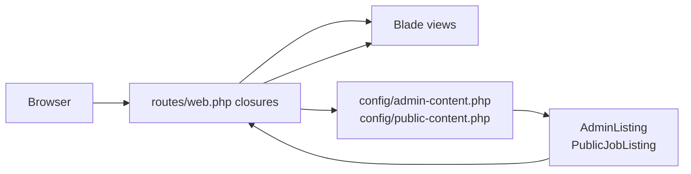
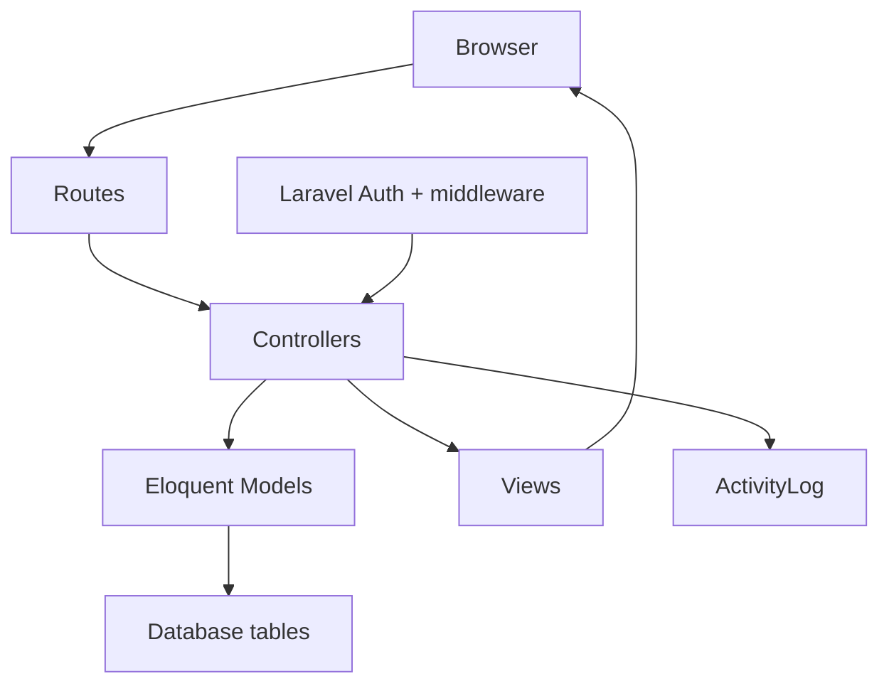
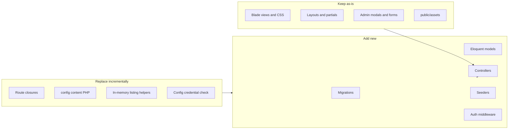

# Backend & Database Transition Guide

> **PESO Connect — manual implementation reference**  
> Use this doc while building the backend yourself. Ask for help step-by-step in Cursor when you get stuck on a phase.

Related files:
- ERD: [`docs/peso-connect-erd.dbml`](peso-connect-erd.dbml)
- Class diagram: [`docs/peso-connect-class-diagram.drawio`](peso-connect-class-diagram.drawio)

---

## How to view this doc

### Easiest way — Markdown Preview (recommended)

1. Keep this file open: `docs/backend-database-plan.md`
2. Press **Ctrl + Shift + V** — opens the formatted preview in a new tab
3. Side-by-side (source + preview): press **Ctrl + K**, release, then press **V**

Or use the menu: **View → Open Preview** (while this file is focused).

---

### Cursor Plans styled view (from Agent)

That layout is for plan files saved by Cursor Agent — not the Command Palette.

**Open the plan file directly:**
1. In the file explorer, open `.cursor/plans/backend_database_transition_8f2ee3af.plan.md`

If you don’t see `.cursor`, use **File → Open File** and paste:
```
c:\Users\jabez\.cursor\plans\backend_database_transition_8f2ee3af.plan.md
```

**From Agent chat:** **Ctrl + I** opens Agent → **Shift + Tab** in the chat box switches to Plan mode (for creating new plans).

---

### If Ctrl + Shift + P doesn’t work

That shortcut opens the Command Palette, which isn’t required to read this doc. Alternatives:
- **F1**
- **View → Command Palette** from the top menu
- Check **File → Preferences → Keyboard Shortcuts** → search `command palette` to see or rebind it (Windows or other apps sometimes override **Ctrl + Shift + P**)

---

### On GitHub

Push this file to your repo — GitHub renders `.md` files automatically, including mermaid diagrams.

### If mermaid diagrams don’t show in preview

- Try **Ctrl + Shift + V** first — many Cursor builds render mermaid there
- Or install the **Markdown Preview Mermaid Support** extension

| What you want | What to do |
|---------------|------------|
| Read this guide nicely | **Ctrl + Shift + V** on `docs/backend-database-plan.md` |
| Cursor Agent plan UI | Open `.cursor/plans/backend_database_transition_8f2ee3af.plan.md` |
| Share for capstone | Push to GitHub or print preview to PDF |

---

## Checklist (track your progress)

- [x] **Phase 1 — Foundation:** migrations, models, seeders
- [x] **Phase 2 — Auth & structure:** login, middleware, controllers
- [x] **Phase 3 — Wire pages:** Jobs → Announcements → Applicants → Certifications → Referrals → Activity logs → Reports → Dashboard
- [x] **Phase 4 — Cleanup:** remove config placeholders, add validation

### Post-launch polish (completed)

- [x] Form validation UI (`@error` summaries + `<x-field-error>` on key fields)
- [x] Public announcement detail page (`/announcements/{slug}`)
- [x] Admin delete enlistee
- [x] Multiple admin accounts in seeder
- [x] FTJS optional ID document upload
- [x] Email notifications on public form submit (`MAIL_MAILER=log` in dev)
- [x] Feature tests (auth, jobs page, enlistment)
- [x] Demo script: [`docs/demo-script.md`](demo-script.md)
- [x] Deployment guide: [`docs/deployment.md`](deployment.md)

---

## Short answer on the frontend

**You do not need to transfer frontend files to a new project.** The UI is already inside Laravel at `resources/views/`. What you built during testing (Blade pages, layouts, partials, CSS, modals, forms) **stays where it is**.

What changes is **where data comes from** — config PHP arrays today, MySQL/SQLite tables tomorrow.

---

## What you have now (testing / prototype phase)



| Layer | Current state |
|-------|----------------|
| **Frontend** | Blade templates in `resources/views/public/` and `resources/views/admin/` |
| **Routing** | All logic in `routes/web.php` as inline closures (no controllers) |
| **Data** | Hardcoded sample data in `config/admin-content.php` and `config/public-content.php` |
| **Filtering / pagination** | In-memory via `app/Support/AdminListing.php` and `PublicJobListing.php` |
| **Database** | Only default Laravel tables in `database/migrations/` — `users`, `cache`, queue `jobs`. **No PESO tables yet.** |
| **Models** | Only unused `app/Models/User.php` |
| **Forms (POST)** | Every submit redirects with flash: *"Backend processing is not yet implemented."* |
| **Admin auth** | Plain text compare against `config('admin-content.credentials')` — no sessions, no middleware |
| **Figma exports** | `resources/views/**/from figma/` and `index.html` files — **reference only**, not used by live routes |

This is a **working UI prototype**: pages render, filters work, modals open — but nothing persists.

---

## What the target architecture looks like



Standard Laravel flow:

1. **Browser** hits a route (e.g. `GET /admin/jobs`)
2. **Controller** loads data from the **database** via **Eloquent models**
3. **Controller** passes data to the **same Blade view** you already have
4. **POST forms** validate input, save to DB, write **activity log**, redirect with success message

Your ERD in `docs/peso-connect-erd.dbml` defines the tables:

- `ADMIN`, `JOBS`, `APPLICANT`, `REFERRAL`, `CERTIFICATION`, `ANNOUNCEMENTS`, `ACTIVITY_LOGS`
- Optional later: `REPORTS` (if stored exports)

---

## How each part maps (ERD → Laravel)

| ERD table | Laravel piece | Used by pages |
|-----------|---------------|---------------|
| ADMIN | `Admin` model + auth | Login, all admin actions |
| JOBS | `Job` model | Find Jobs, Job Management, Enlistment job picker |
| APPLICANT | `Applicant` model | Enlistment, Enlistee Management |
| REFERRAL | `Referral` model | Referral Requests, Referral Management |
| CERTIFICATION | `Certification` model | FTJS form, FTJS admin |
| ANNOUNCEMENTS | `Announcement` model | Public announcements, admin CRUD |
| ACTIVITY_LOGS | `ActivityLog` model | Activity Logs page (auto-written on admin actions) |

**Relationships** (from your ERD) drive foreign keys in migrations, e.g. `jobs.admin_id → admins.admin_id`.

---

## Database choice: SQLite vs MySQL

Both work with Laravel. You can start local with one and deploy with another.

| | **SQLite** | **MySQL / MariaDB** |
|---|-----------|---------------------|
| **Good for** | Fast local dev, small demos | Capstone production, multi-user, hosting |
| **Current setup** | Default in `.env.example` and `render.yaml` | Commented out in `.env.example` |
| **Pros** | Zero install, single file | Better for concurrent admins, standard on Hostinger/cPanel/etc. |
| **Cons** | Weak for heavy concurrent writes | Needs a DB server or cloud DB |

**Recommendation:** Use **SQLite locally** while building migrations/models, then switch to **MySQL** for final deployment if your school/host provides it. Laravel migrations are the same — only `.env` connection settings change.

---

## Do any frontend files need to move?

| File/folder | Action |
|-------------|--------|
| `resources/views/public/*.blade.php` | **Keep** — live public pages |
| `resources/views/admin/*.blade.php` | **Keep** — live admin pages |
| `resources/views/partials/` | **Keep** — header, footer, modals, styles |
| `resources/views/layouts/` | **Keep** |
| `public/assets/img/peso-logo.png` | **Keep** |
| `from figma/` HTML folders | **Optional archive/delete** — not wired to routes |
| `config/*-content.php` | **Replace gradually** — seeders copy sample data into DB, then routes read from DB instead |

**Minor view updates later:** Templates today use array syntax (`$job['title']`). With Eloquent you can either:
- Use `$job->title` in Blade, or
- Map models to arrays in the controller so views barely change

Example today in `partials/public/job-card-landing.blade.php`: `{{ $job['title'] }}` → later `{{ $job->job_title }}` or keep array via `$job->toArray()`.

---

## Recommended build order (backend phase)

### Phase 1 — Foundation
- Create migrations for all 7 ERD tables
- Create Eloquent models with relationships (`Admin hasMany Jobs`, etc.)
- Seed database from existing config sample data (`database/seeders/DatabaseSeeder.php`)
- Run `php artisan migrate --seed`

### Phase 2 — Auth & structure
- Real admin login (Laravel session auth, hashed passwords)
- Admin middleware protecting `/admin/*` routes
- Extract route closures into controllers (`JobController`, `ApplicantController`, etc.)

### Phase 3 — Wire pages one by one
Suggested order (simplest → most connected):

1. **Jobs** — admin CRUD + public listing (replaces `PublicJobListing` + config jobs)
2. **Announcements** — admin CRUD + public page
3. **Applicants / Enlistment** — public form saves to DB, admin enlistee management reads DB
4. **Certifications** — FTJS form + admin approval flow
5. **Referrals** — public request + admin approve/deny
6. **Activity logs** — auto-log on every admin write action
7. **Reports** — aggregate queries from DB; optional `REPORTS` table for stored exports
8. **Dashboard** — replace static stats with real `COUNT()` queries

### Phase 4 — Cleanup
- Remove or slim down config-driven data files
- Remove "not yet implemented" flash messages
- Add form validation (`FormRequest` classes)
- Optional: delete unused Figma HTML reference folders

---

## What stays the same vs what gets replaced



---

## Example: one feature end-to-end (Jobs)

**Today:** `routes/web.php` reads `config('admin-content.admin_jobs')`, filters in `AdminListing`, renders `admin/job-management.blade.php`.

**After backend:**
1. `jobs` table stores rows
2. `JobController@index` runs `Job::query()->when($search)...->paginate(4)`
3. Same Blade view receives `$jobs` collection
4. `JobController@store` validates POST, saves row, logs activity, redirects
5. Public `/jobs` uses same `Job` model with `status = Active`

The page **looks identical**; only the data source changes.

---

## Summary

- **Frontend:** Already in the right place inside Laravel. No transfer to another repo or framework required.
- **Backend today:** Config files + helper classes simulating a database.
- **Backend next:** Migrations + models + controllers + real auth, matching your ERD.
- **Figma HTML folders:** Safe to ignore or delete; they were design references during testing.
- **Database:** Start with SQLite locally; move to MySQL when deploying if needed — same Laravel code.

**Start with Phase 1** (migrations + models + seeders) when you're ready to code.

---

## How to get help while learning manually

When working through a phase, ask things like:

- *"Help me write the migration for the JOBS table based on our ERD"*
- *"Walk me through creating the Job model and its relationship to Admin"*
- *"Why is my seeder failing?"*
- *"How do I change job-management.blade.php to use Eloquent instead of config arrays?"*

You do the typing; I explain, review, and debug with you.
